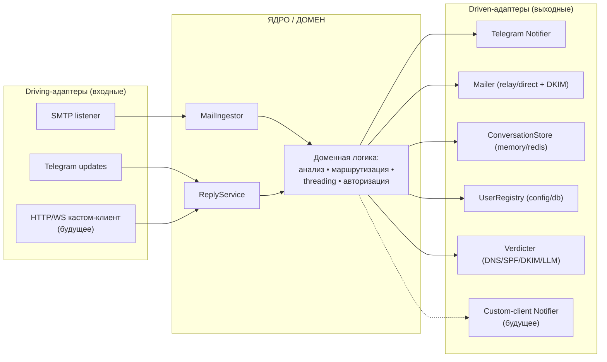
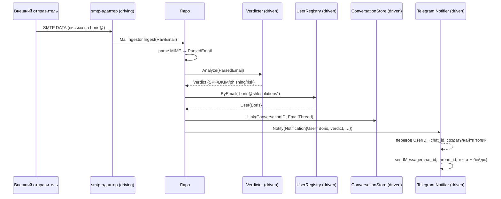
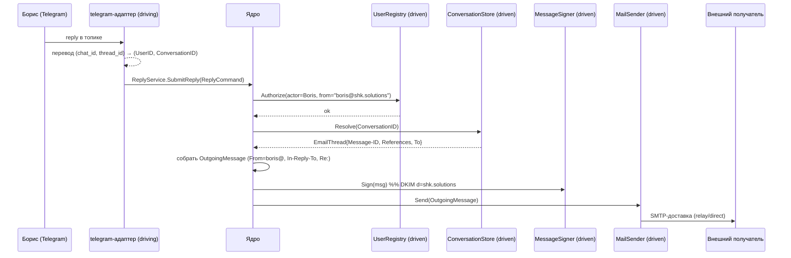

# 🏛️ Go-MailShield — Архитектурный документ

> **Статус:** проектное решение (design doc)
> **Дата:** 2026-07-24
> **Домен:** `shk.solutions` (боевой VPS, DNS настроен)
> **Область:** архитектура эволюции проекта из inbound-only анализатора почты
> в **фильтрующий email ↔ Telegram мост** для маленькой команды, построенный
> по гексагональной архитектуре (ports & adapters) с прицелом на подключение
> кастомного клиента в будущем.

---

## Оглавление

1. [Продуктовая концепция](#1-продуктовая-концепция)
2. [Цели и не-цели](#2-цели-и-не-цели)
3. [Общая архитектура (Ports & Adapters)](#3-общая-архитектура-ports--adapters)
4. [Доменная модель](#4-доменная-модель)
5. [Порты](#5-порты)
6. [Адаптеры](#6-адаптеры)
7. [Потоки данных](#7-потоки-данных)
8. [Multi-user маршрутизация и топология Telegram](#8-multi-user-маршрутизация-и-топология-telegram)
9. [Состояние переписки (threading)](#9-состояние-переписки-threading)
10. [Безопасность и доставляемость](#10-безопасность-и-доставляемость)
11. [Структура пакетов](#11-структура-пакетов)
12. [Точки расширения: кастомный клиент](#12-точки-расширения-кастомный-клиент)
13. [Эволюция хранилища](#13-эволюция-хранилища)
14. [Связь с Roadmap](#14-связь-с-roadmap)
15. [Журнал ключевых решений (ADR-lite)](#15-журнал-ключевых-решений-adr-lite)
16. [Открытые вопросы](#16-открытые-вопросы)

---

## 1. Продуктовая концепция

Go-MailShield перестаёт быть «тупиком» (принял письмо → распечатал в лог) и
становится **фильтрующим мостом между email и Telegram**:

- Письма на адреса домена (`fima@shk.solutions`, `boris@shk.solutions`, …)
  принимаются по SMTP, **проходят анализ безопасности** (SPF/DKIM/DMARC,
  фишинг, вложения) и **пересылаются владельцу в Telegram** с бейджем вердикта.
- Ответ сотрудника **прямо в Telegram** превращается в исходящее письмо
  **от его адреса**, ложится в тот же email-тред и уходит отправителю.

Ключевые следствия концепции:

- **Telegram = почтовый клиент и UI.** Не нужны IMAP, webmail, хранилище
  ящиков, Dovecot/Roundcube — это снимает тяжёлую ops-нагрузку
  «почты как у взрослых».
- **Отличительная черта — не тупой мост, а фильтрующий.** Спам/фишинг
  предварительно отсеян и помечен; вложения проверяются **до** форварда
  (scan-before-forward — одновременно фича и защита самого получателя).
- **Go-ядро остаётся ценностью** (кастомная логика шлюза), а не «я поставил
  готовый почтовый стек».

---

## 2. Цели и не-цели

### Цели

- Приём входящей почты по SMTP и анализ безопасности (существующее ядро).
- Маршрутизация письма → нужному сотруднику в Telegram.
- Отправка ответа из Telegram → корректное исходящее письмо (threading + DKIM).
- Поддержка **нескольких ящиков/сотрудников** (multi-user) на одном боте.
- **Изоляция переписки** между сотрудниками и между тредами.
- **Заменяемость транспорта**: сегодня Telegram, завтра — кастомный клиент,
  без переписывания ядра.

### Не-цели (сознательно вне области)

- ❌ Реимплементация IMAP/POP3, webmail, хранилища ящиков, антиспам-движка
  с нуля — это годы работы и переизобретение security-критичного софта.
- ❌ Массовая рассылка (bulk/marketing email).
- ❌ Открытый релей (open relay) — отправка строго авторизована.
- ❌ Замена промышленного почтового провайдера для критичной переписки.

---

## 3. Общая архитектура (Ports & Adapters)

Принцип: **ядро (домен) объявляет интерфейсы-порты; адаптеры их реализуют;
все зависимости смотрят внутрь.** Ядро никогда не импортирует `tgbotapi`,
`smtpd`, `redis`, `net.Addr` — транспорт и инфраструктура заменяются без правок
домена.

Порты делятся на два класса:

- **Driving (входные / primary)** — как внешний мир *дёргает* приложение
  (use-cases, которые ядро выставляет наружу).
- **Driven (выходные / secondary)** — что приложению *нужно снаружи*
  (ядро объявляет интерфейс, инфраструктура реализует).



> **Важно:** Telegram присутствует **с обеих сторон** гексагона — как
> driving-адаптер (входящий reply дёргает `ReplyService`) и как driven-адаптер
> (`Notifier`, ядро пушит уведомление). Будущий кастомный клиент подключается
> **точно так же — парой адаптеров** к уже существующим портам.

### Дисциплина границ (где такие проекты обычно текут)

Транспортные понятия **не просачиваются в ядро**. `chat_id`,
`message_thread_id` — язык Telegram. Ядро оперирует только доменными
идентификаторами: `UserID`, `ConversationID`. Перевод
`(chat_id, thread_id) ↔ (UserID, ConversationID)` выполняет **Telegram-адаптер
на своей границе**. Кастомный клиент переведёт свои идентификаторы в те же
доменные — и потому любой клиент взаимозаменяем.

---

## 4. Доменная модель

Чистые типы без инфраструктурных зависимостей.

| Тип | Назначение |
| :--- | :--- |
| `RawEmail` | Сырые байты письма + конверт (IP отправителя, `MAIL FROM`, `RCPT TO[]`). |
| `ParsedEmail` | Результат разбора MIME: заголовки, `Subject`, текст/HTML, вложения, `Message-ID`. |
| `Verdict` | Итог анализа: SPF/DKIM/DMARC, фишинг-эвристики, находки во вложениях, интегральный risk score (1–10), метка `clean`/`suspicious`/`malicious`. |
| `User` / `Mailbox` | Адрес, отображаемое имя, привязки к клиентам, права. |
| `ConversationID` | Доменный id переписки (не `chat_id`, не `thread_id`). |
| `EmailThread` | `Message-ID`, `References`, `Subject`, внешний участник, владелец (`User`). |
| `Notification` | То, что пушится клиенту (from/subject/body/verdict/attachments). |
| `ReplyCommand` | Транспортно-нейтральная команда ответа (actor, conversation, body, attachments). |
| `OutgoingMessage` | Готовое к подписи и отправке письмо (From, To, Subject, In-Reply-To, References, тело, вложения). |

---

## 5. Порты

Порты держим **крупными, на уровне use-case** (не «интерфейс на каждый вызов БД»).

```go
package core

import "context"

// ---- DRIVING (входные) порты: use-cases, которые ядро выставляет ----

// Вызывается SMTP-адаптером на каждое принятое письмо.
type MailIngestor interface {
    Ingest(ctx context.Context, raw RawEmail) error
}

// Вызывается Telegram-адаптером (и будущим кастом-клиентом) при ответе.
type ReplyService interface {
    SubmitReply(ctx context.Context, cmd ReplyCommand) error
}

// ReplyCommand транспортно-нейтральна: адаптер уже перевёл свои id в доменные
// и аутентифицировал актора.
type ReplyCommand struct {
    Actor        UserID         // кто отвечает (аутентифицирован адаптером)
    Conversation ConversationID // доменный id, НЕ chat_id/thread_id
    Body         string
    Attachments  []Attachment
}

// ---- DRIVEN (выходные) порты: что ядру нужно снаружи ----

// Notifier — сюда подключается ЛЮБОЙ клиент (Telegram, кастомный, …).
type Notifier interface {
    Notify(ctx context.Context, n Notification) error
}

// MailSender — доставка исходящего письма (relay/direct MTA).
type MailSender interface {
    Send(ctx context.Context, msg OutgoingMessage) error
}

// MessageSigner — DKIM-подпись исходящего (d=shk.solutions).
type MessageSigner interface {
    Sign(msg *OutgoingMessage) error
}

// ConversationStore — маппинг переписки ↔ email-тред.
type ConversationStore interface {
    Link(id ConversationID, thread EmailThread) error
    Resolve(id ConversationID) (EmailThread, bool)
}

// UserRegistry — реестр сотрудников и авторизация.
type UserRegistry interface {
    ByEmail(addr string) (User, bool)
    Authorize(actor UserID, fromAddr string) bool
}

// Verdicter — анализ безопасности; внутри сам зовёт driven-порты DNS/LLM.
type Verdicter interface {
    Analyze(ctx context.Context, e ParsedEmail) Verdict
}
```

Подчинённые driven-порты `Verdicter` (реализуются инфраструктурными адаптерами):
`DNSResolver`, `SPFChecker`, `DKIMVerifier`, `DMARCEvaluator`, `LLMRiskScorer`.

---

## 6. Адаптеры

| Класс | Адаптер | Реализует / дёргает | Технология |
| :--- | :--- | :--- | :--- |
| Driving | `smtp` | дёргает `MailIngestor` | `mhale/smtpd` или `emersion/go-smtp` |
| Driving | `telegram` (updates) | дёргает `ReplyService` | long-polling `getUpdates` |
| Driving | `httpapi` *(будущее)* | дёргает `ReplyService` | REST/WS/gRPC |
| Driven | `telegram` (notifier) | `Notifier` | Bot API `sendMessage`/`sendDocument` |
| Driven | `mailer` | `MailSender` + `MessageSigner` | relay (smart host) / direct MTA, DKIM |
| Driven | `store` | `ConversationStore`, `UserRegistry` | in-memory → **SQLite** (`modernc.org/sqlite`, без cgo); Postgres/Redis — ветки роста |
| Driven | `dns` | `DNSResolver`/`SPFChecker`/… | `net.LookupTXT/MX`, `context` timeouts |
| Driven | `llm` *(будущее)* | `LLMRiskScorer` | Claude/OpenAI API |
| Driven | `customclient` *(будущее)* | `Notifier` | push/WS |

> Telegram — это **два адаптера**, разделяющие один клиент бота: driving
> (слушает updates, инициирует reply) и driven (пушит уведомления). Это норма.

---

## 7. Потоки данных

### 7.1. Входящий: email → Telegram



### 7.2. Исходящий: Telegram → email



---

## 8. Multi-user маршрутизация и топология Telegram

Переход от одного `support@` к нескольким ящикам — это **обобщение**, а не
переделка. Добавляется слой **маршрутизации по получателю**.

- **Входящее:** `RCPT TO` → `UserRegistry.ByEmail` → чат нужного сотрудника.
- **Исходящее:** апдейт из чата Бориса → `From: boris@shk.solutions`.
- **Авторизация per-user:** `chat_id` Бориса может слать **только** от `boris@`.
- **DKIM:** подпись по домену (`d=shk.solutions`) → **один ключ на все адреса**.
- **Неизвестный получатель:** `550 unknown user` (чище catch-all, без backscatter).
- **Алиасы/рассылки:** `team@` → fan-out в чаты нескольких сотрудников (падает
  из той же модели маршрутизации).

### Выбранная топология — «Вариант 2»: личная группа + топики у каждого

**Один бот** состоит в нескольких приватных supergroup'ах (forum mode):

```
                 ┌─────────────┐
                 │  ОДИН бот   │  (один токен)
                 └──────┬──────┘
          ┌────────────┴────────────┐
   [Boris Mail] (forum)       [Fima Mail] (forum)
    ├─ 🧵 client@acme — Заказ №42     ├─ 🧵 partner@x — Договор
    └─ 🧵 vendor@corp — Инвойс ⚠️     └─ 🧵 hr@job — Вакансия
   (Борис + бот)                     (Фима + бот)
```

**Как это изолирует на одном боте:**

1. **Между людьми — `chat_id`.** Разные группы; Фима не состоит в группе
   Бориса → физически не видит его почту. Изоляцию гарантирует Telegram
   (membership), а не наш код.
2. **Между переписками — `message_thread_id`.** Forum-топики внутри группы;
   каждая переписка = отдельный топик.

Каждый входящий `Update` содержит `chat.id` **и** `message_thread_id` — это и
есть полный «адрес» ответа: первый выбирает человека, второй — тред.

**Требования к настройке:**

- Один бот у `@BotFather` (один токен на всё).
- По supergroup на человека, включён **Topics**.
- Бот — **админ с правом «Manage Topics»** (`can_manage_topics`), иначе не
  сможет создавать топики через API.
- `chat_id` каждой группы (большое отрицательное `-100…`) записан в реестр.

**Оговорки:**

- Правильность маршрутизации — **на нашем коде**; баг в `registry` может увести
  письмо Бориса в чат Фимы. Telegram страхует только чужую видимость.
- Один бот = **одна точка доверия**: владелец токена технически видит все
  группы (бот и есть мост). Для маленькой фирмы — приемлемо.

> Про запас: **Вариант 3** — одна общая группа-инбокс с топиками — для
> командных ящиков (`support@`, `sales@`), где заявку берёт любой свободный.
> Отличается тем, что даёт **общую видимость** вместо личной почты.

---

## 9. Состояние переписки (threading)

Сердце системы — двусторонний маппинг:

```
ConversationID  ↔  EmailThread{ external_sender, Subject, Message-ID, References }
             и  ↔  привязка к транспорту клиента (в адаптере: chat_id + thread_id)
```

- При входящем создаётся `ConversationID`, `ConversationStore.Link(...)`
  сохраняет email-тред; Telegram-адаптер заводит топик и держит своё
  соответствие `ConversationID ↔ (chat_id, thread_id)`.
- При ответе `ConversationStore.Resolve(...)` возвращает `Message-ID`/`References`,
  чтобы проставить `In-Reply-To`/`References` и `Re: Subject` — тогда ответ
  ложится **в тот же тред** в почте отправителя.
- Сейчас — in-memory; далее — Redis/БД с TTL (см. §13).

---

## 10. Безопасность и доставляемость

### Авторизация (критично)

- Отвечать через бота может **только** привязанный `chat_id`, и **только** от
  своего адреса (`UserRegistry.Authorize`). Иначе — open relay через Telegram.
- Вложения и ссылки проверяются **до** форварда в Telegram (не тащить малварь
  себе же).

### Доставляемость исходящего (код — 10%, deliverability — 90%)

Написать SMTP-клиент просто; заставить письмо дойти до инбокса — нет.
Чек-лист для `shk.solutions`:

| Требование | Зачем | Действие |
| :--- | :--- | :--- |
| Исходящий порт 25 | Многие VPS (IONOS) блокируют по умолчанию | Проверить `telnet gmail-smtp-in.l.google.com 25`; запросить разблокировку **или** идти через relay |
| PTR / rDNS | Без валидного PTR Gmail/Outlook режут | Поставить `mail.shk.solutions` в панели, совпадает с HELO и A |
| DKIM подпись + DNS | Аутентификация исходящего | Подписывать (`d=shk.solutions`), опубликовать `selector._domainkey` |
| SPF | Разрешить IP отправлять | `ip4:<IP>` в TXT (не только `-all`) |
| DMARC | Политика согласования | Начать с `p=none` (мониторинг) |
| Репутация IP | VPS-диапазоны часто в блок-листах | Проверить на Spamhaus/mxtoolbox |

**Прагматика:** для надёжной доставки — `RelaySender` через reputable smart
host (SES/Mailgun/Postmark). `DirectMTASender` (свой MX-резолвинг + STARTTLS +
DSN) держим как альтернативную реализацию `MailSender` для обучения.
Плюс: ответы тем, кто написал **нам первым**, доходят заметно лучше.

---

## 11. Структура пакетов

```
/internal
  /core
     model.go            # Email, Verdict, Conversation, User, Reply — чистый домен
     ports.go            # интерфейсы портов (или split: inbound.go / outbound.go)
     /app                # реализация use-cases
        ingest.go        # MailIngestor
        reply.go         # ReplyService
        analyze.go       # оркестрация анализа
  /adapters
     /inbound  (driving)
        /smtp            # → MailIngestor
        /telegram        # updates → ReplyService
        /httpapi         # БУДУЩИЙ кастом-клиент → ReplyService
     /outbound (driven)
        /telegram        # Notifier (push в TG)
        /mailer          # MailSender + MessageSigner (relay/direct + DKIM)
        /store           # ConversationStore, UserRegistry (memory/redis)
        /dns   /llm      # зависимости Verdicter
main.go                  # composition root: единственное место, знающее конкретные типы
```

**Правило зависимостей:** `core` не импортирует ничего из `adapters`.
`adapters` импортируют `core` (реализуют/вызывают порты). `main.go` знает всех
и связывает (dependency injection).

---

## 12. Точки расширения: кастомный клиент

Именно ради этого выбрана гексагональная архитектура. Подключение нового
клиента (web/mobile/desktop) — **три шага, ядро и существующие адаптеры не
меняются**:

1. **Driving-адаптер** `/adapters/inbound/httpapi` (REST/WS/gRPC): аутентифицирует
   своего юзера, переводит свои id в доменные (`UserID`/`ConversationID`), зовёт
   тот же `ReplyService.SubmitReply`.
2. **Driven-адаптер** `/adapters/outbound/customclient`, реализующий `Notifier`:
   пушит уведомления в этот клиент.
3. **Одна строка** проводки в `main.go`.

Нужно, чтобы уведомление шло **и** в Telegram, **и** в кастом-клиент —
заворачиваем оба `Notifier` в **composite (fan-out) Notifier**. Тоже без правок
ядра.

```go
// Composite Notifier: рассылает во все подключённые клиенты.
type FanOutNotifier struct{ targets []core.Notifier }

func (f FanOutNotifier) Notify(ctx context.Context, n core.Notification) error {
    for _, t := range f.targets {
        if err := t.Notify(ctx, n); err != nil {
            // логировать/накапливать; не ронять остальные каналы
        }
    }
    return nil
}
```

---

## 13. Эволюция хранилища

**Путь:** `InMemoryStore` → **SQLite (primary)** → *(при необходимости)* Postgres / Redis.

- **Сейчас (bootstrap):** `InMemoryStore` (потокобезопасный, `sync.RWMutex`) —
  реализация портов `ConversationStore`/`UserRegistry`. Годится только для
  первого прогона: **при рестарте теряются маппинги тредов** → входящий ответ
  из Telegram некуда прицепить (потеряны `Message-ID`/`References`).
- **База этапа — `SQLiteStore`.** Для текущей задачи (несколько ящиков,
  человеко-темповый поток писем, один VPS, один бинарник) SQLite — не «затычка»,
  а правильный дефолт:
  - **Durability = корректность:** переживает рестарт, маппинги тредов не теряются.
  - **Реляционность:** `users`/`conversations`/`messages`/`verdicts` со связями
    и запросами (история, аудит, поиск) — Redis (KV/кэш) для этого неудобен.
  - **Ноль ops:** один файл, без отдельного контейнера/демона/сети — важно на
    1 GB VPS.
  - **ACID:** атомарная связка «переписка + тред + топик» одним коммитом.
  - **Бэкап** — копированием файла.
  - **Драйвер — `modernc.org/sqlite` (чистый Go, без cgo)**, чтобы сохранить
    статическую сборку `CGO_ENABLED=0` (`mattn/go-sqlite3` требует cgo и сломал бы
    её). При открытии: `PRAGMA journal_mode=WAL; PRAGMA busy_timeout=5000;`.
    Единственный писатель — сам бинарник, конкуренции при таком объёме нет.
- **Ветки роста (не сейчас):**
  - **Postgres** — если появится горизонтальное масштабирование / несколько
    инстансов приложения (SQLite — single-node).
  - **Redis** — только как **hot-кэш с TTL** (например, кэш ответов DNS/SPF/DKIM),
    а не как primary-хранилище. Изначальный план из TODO (`RedisStore` как основа)
    пересмотрен: эти данные — первичные и реляционные, а не кэш.
- Поскольку это **порт**, любая замена — это адаптер: ядро и клиенты не трогаются.

---

## 14. Связь с Roadmap

Эта архитектура **осмысливает** существующий `SMPT_SELF_TODO.md` — каждый этап
получает своё место:

| Этап TODO | Где живёт в архитектуре |
| :--- | :--- |
| DKIM/DMARC (Этап 1) | `Verdicter` (входящий) + `MessageSigner` (исходящий) |
| Phishing/URL/Attachment (Этап 1) | `Verdicter` эвристики → `Verdict.risk` |
| SQLite + `slog` + `context` (Этап 2) | `store`-адаптер (`modernc.org/sqlite`) + сквозной `ctx` в портах |
| REST API (Этап 3) | driving-адаптер `httpapi` (он же — задел под кастом-клиент) |
| AI/LLM risk score (Этап 4) | driven-порт `LLMRiskScorer` → адаптер `llm` |
| Тесты/линт (Этап 5) | ядро тестируется на моках портов (без сети) |

Отдельный выигрыш: **ядро тестируется юнит-тестами на подставных портах** —
без SMTP, без Telegram, без сети.

---

## 15. Журнал ключевых решений (ADR-lite)

| # | Решение | Причина |
| :--- | :--- | :--- |
| 1 | Telegram как UI вместо IMAP/webmail | Снимает ops-нагрузку почтового стека; Go-ядро остаётся ценностью |
| 2 | Гексагональная архитектура | Явная цель — заменяемость клиента без переписывания ядра |
| 3 | Мост — **фильтрующий** (scan-before-forward) | Дифференциатор + защита получателя от малвари |
| 4 | Один бот, Вариант 2 (личные группы + топики) | Приватность (chat_id) + треды (thread_id) на одном токене |
| 5 | Исходящее — предпочтительно через relay | Deliverability; `DirectMTA` — как учебная альтернатива |
| 6 | Один DKIM-ключ на домен | `d=shk.solutions` покрывает все адреса; проще |
| 7 | Неизвестный получатель → `550` | Чище catch-all, без backscatter |
| 8 | Транспортные id не проникают в ядро | Перевод на границе адаптера = взаимозаменяемость клиентов |
| 9 | **SQLite как primary-хранилище** (вместо Redis из TODO) | Данные первичные, долговечные и реляционные, а не кэш; durability нужна для сохранности маппингов тредов; ноль ops на 1 GB VPS. Драйвер `modernc.org/sqlite` (без cgo) сохраняет статическую сборку `CGO_ENABLED=0`. Redis — только как опциональный TTL-кэш, Postgres — при multi-node |

---

## 16. Открытые вопросы

- **Онбординг привязки:** статический конфиг (`email ↔ chat_id`) для MVP vs
  self-service `/link <адрес> <код>` — когда переходить?
- **Порт 25 у IONOS:** открыт ли исходящий? Если нет и не разблокируют —
  архитектура смещается к **relay-only**.
- **Личные vs общие ящики:** `fima@`/`boris@` — личная почта (Вариант 2) или
  часть общего инбокса (Вариант 3) для каких-то адресов?
- **Хранение истории:** Telegram как единственный архив, или дублировать
  переписку в БД для поиска/аудита?
- **Webhook vs long-polling:** для MVP — long-polling; переход на webhook при
  росте (нужен публичный HTTPS-эндпоинт, домен уже есть).

---

*Документ описывает целевую архитектуру и решения на 2026-07-24. По мере
реализации обновляйте разделы §5–§7 (сигнатуры портов) и §15 (журнал решений).*
