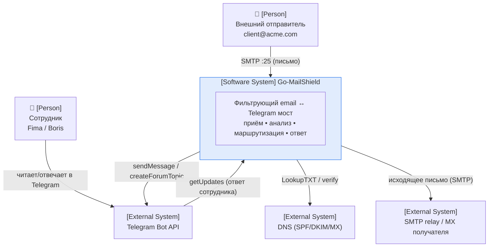
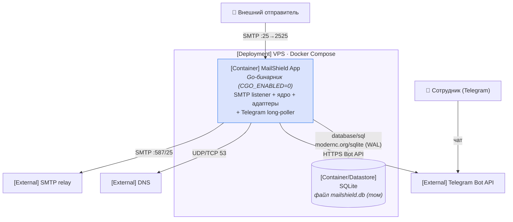
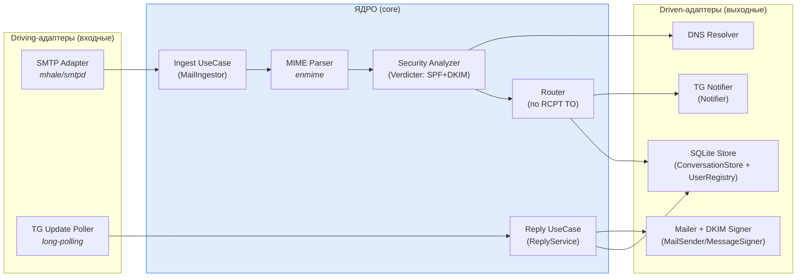
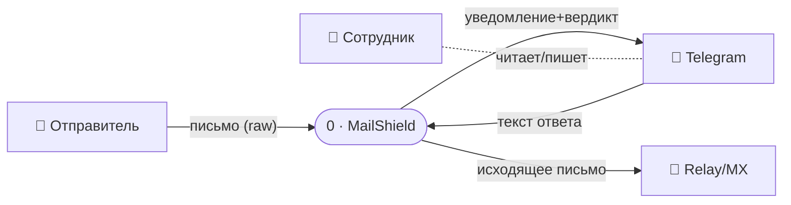
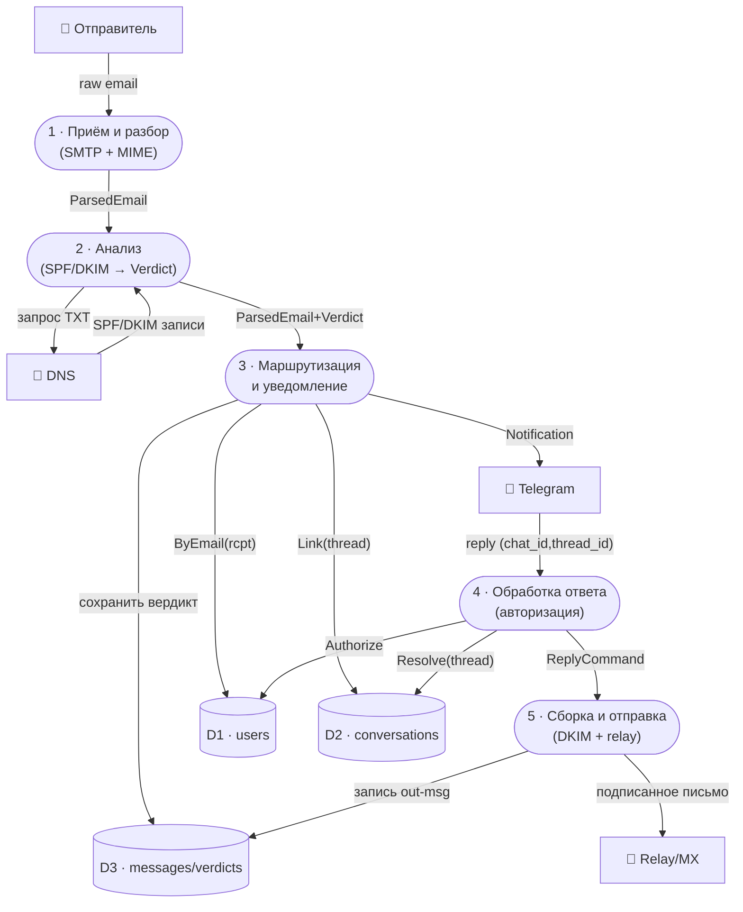
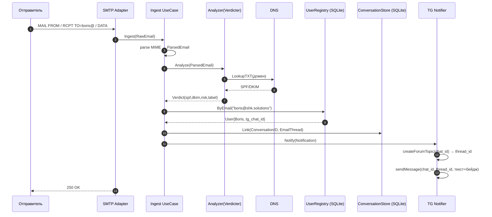
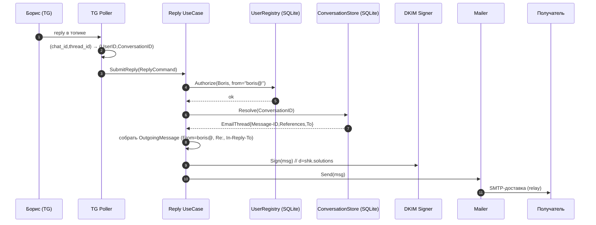
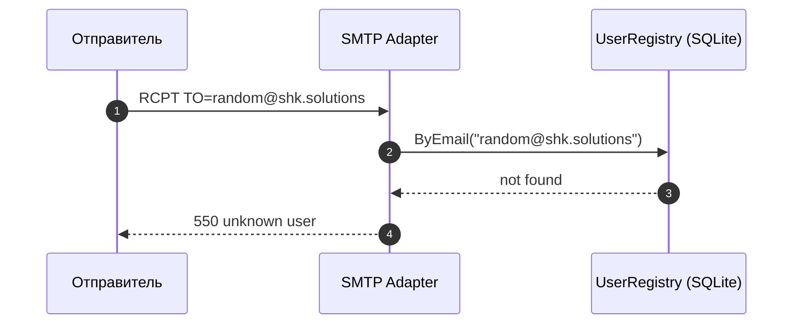

# 📐 Go-MailShield — Дизайн MVP (до начала кодинга)

> **Цель:** зафиксировать архитектурное решение **до написания кода**.
> **Метод:** модель **C4** (Context → Containers → Components), диаграммы потоков
> данных **(DFD)** и **sequence**-диаграммы.
> **Статус:** дизайн MVP · **Дата:** 2026-07-24
> **Контекст:** этот документ — MVP-срез целевой архитектуры из
> [`ARCHITECTURE.md`](./ARCHITECTURE.md) (ports & adapters). Здесь описан
> **минимум, который строим первым**; полная картина и обоснования решений — там.

---

## Оглавление

1. [Что делает MVP](#1-что-делает-mvp)
2. [Границы MVP (scope)](#2-границы-mvp-scope)
3. [C4 · Уровень 1 — System Context](#3-c4--уровень-1--system-context)
4. [C4 · Уровень 2 — Containers](#4-c4--уровень-2--containers)
5. [C4 · Уровень 3 — Components](#5-c4--уровень-3--components)
6. [DFD · Диаграммы потоков данных](#6-dfd--диаграммы-потоков-данных)
7. [Sequence-диаграммы](#7-sequence-диаграммы)
8. [Модель данных (SQLite)](#8-модель-данных-sqlite)
9. [Внешние интерфейсы и контракты](#9-внешние-интерфейсы-и-контракты)
10. [Конфигурация](#10-конфигурация)
11. [Критерии готовности MVP (Definition of Done)](#11-критерии-готовности-mvp-definition-of-done)
12. [Допущения и риски](#12-допущения-и-риски)

---

## 1. Что делает MVP

Одной фразой: **письмо на адрес сотрудника попадает ему в Telegram с бейджем
безопасности; ответ из Telegram уходит письмом от его адреса в тот же тред.**

Сквозной сценарий MVP:

1. Внешний отправитель шлёт письмо на `boris@shk.solutions`.
2. MailShield принимает по SMTP, парсит MIME, проверяет **SPF + DKIM**.
3. Маршрутизирует по `RCPT TO` → находит сотрудника → создаёт **топик** в его
   личной Telegram-группе и постит письмо + вердикт.
4. Борис отвечает **прямо в топике**.
5. MailShield собирает исходящее письмо (`From: boris@`, threading-заголовки),
   **подписывает DKIM**, отправляет через relay.
6. Всё состояние (пользователи, переписки, треды) — в **SQLite**.

---

## 2. Границы MVP (scope)

| В MVP входит ✅ | В MVP НЕ входит ❌ (отложено в [`ARCHITECTURE.md`](./ARCHITECTURE.md)) |
| :--- | :--- |
| Приём SMTP + разбор MIME | Phishing/URL-эвристики |
| Анализ **SPF + DKIM** (verify) | Сканер вложений (SHA-256, двойные расширения) |
| Маршрутизация по получателю (multi-user) | AI/LLM risk score |
| Telegram: личные группы + топики (**Вариант 2**) | DMARC-энфорсмент (только фиксируем результат) |
| Ответ из Telegram → исходящее письмо | Direct-MTA доставка (в MVP — только relay) |
| DKIM-подпись исходящего | HTTP API / кастомный клиент |
| Threading (`In-Reply-To`/`References`) | Self-service онбординг (`/link`) |
| Хранилище **SQLite** | Webhook (в MVP — long-polling) |
| Реестр пользователей из конфига/БД | Catch-all (неизвестный адрес → `550`) |
| Авторизация per-user на ответах | Вложения из письма → в Telegram (текст-только в MVP) |

**Ключевая цель MVP** — доказать сквозной цикл email ↔ Telegram с корректным
threading и сохранностью состояния между рестартами. Всё остальное — фичи поверх.

---

## 3. C4 · Уровень 1 — System Context

Кто пользуется системой и с чем она общается снаружи.



**Акторы и внешние системы:**

| Элемент | Роль |
| :--- | :--- |
| Внешний отправитель | Шлёт письмо на адрес домена; получает ответ. |
| Сотрудник (Fima/Boris) | Читает входящее и отвечает **внутри Telegram**. |
| Telegram Bot API | Транспорт UI: доставка входящих, приём ответов. |
| DNS | Источник SPF/DKIM-записей (verify) и MX (при direct-доставке, вне MVP). |
| SMTP relay / MX | Последняя миля доставки исходящего. |

---

## 4. C4 · Уровень 2 — Containers

Развёртываемые единицы. MVP умышленно компактен: **один Go-процесс + файл БД**.



**Контейнеры:**

| Контейнер | Технология | Назначение |
| :--- | :--- | :--- |
| **MailShield App** | Go (один статический бинарник) | Весь домен + адаптеры в одном процессе; concurrency через горутины/каналы. |
| **SQLite** | `modernc.org/sqlite`, WAL | Долговечное реляционное хранилище (users/conversations/messages/verdicts). |
| Telegram Bot API | внешний | UI-транспорт. |
| DNS | внешний | SPF/DKIM verify. |
| SMTP relay | внешний | Доставка исходящего (deliverability). |

> В MVP Redis **нет** — состояние первично и реляционно, живёт в SQLite
> (см. §13 `ARCHITECTURE.md`).

---

## 5. C4 · Уровень 3 — Components

Внутренности контейнера **MailShield App** = гексагон. Зависимости смотрят внутрь.



**Компоненты и их порты:**

| Компонент | Класс | Порт (интерфейс) |
| :--- | :--- | :--- |
| SMTP Adapter | driving | дёргает `MailIngestor` |
| TG Update Poller | driving | дёргает `ReplyService` |
| Ingest / Reply UseCase | ядро | реализуют driving-порты, оркестрируют домен |
| Security Analyzer | ядро | `Verdicter` (зовёт `DNSResolver`) |
| Router | ядро | использует `UserRegistry` + `ConversationStore` |
| TG Notifier | driven | `Notifier` |
| Mailer + Signer | driven | `MailSender` + `MessageSigner` |
| SQLite Store | driven | `ConversationStore` + `UserRegistry` |
| DNS Resolver | driven | `DNSResolver` |

> **Уровень 4 (Code)** отдельной диаграммой не рисуем — сигнатуры портов
> зафиксированы в §5 `ARCHITECTURE.md` (`ports.go`).

---

## 6. DFD · Диаграммы потоков данных

**Легенда:** `👤 внешняя сущность` · `([процесс])` · `[(хранилище данных)]`.

### 6.1. DFD Level 0 (контекст)



### 6.2. DFD Level 1 (декомпозиция процессов)



---

## 7. Sequence-диаграммы

### 7.1. Входящий: email → Telegram



### 7.2. Исходящий: Telegram → email



### 7.3. Отклонение неизвестного адреса



---

## 8. Модель данных (SQLite)

```sql
-- Сотрудники / ящики (реестр маршрутизации + авторизация)
CREATE TABLE users (
    id           INTEGER PRIMARY KEY,
    email        TEXT    NOT NULL UNIQUE,        -- boris@shk.solutions
    display_name TEXT,
    tg_chat_id   INTEGER NOT NULL,               -- личная группа (-100...)
    active       INTEGER NOT NULL DEFAULT 1
);

-- Переписки (тред = внешний контакт + владелец + топик)
CREATE TABLE conversations (
    id              TEXT    PRIMARY KEY,          -- ConversationID (uuid)
    owner_user_id   INTEGER NOT NULL REFERENCES users(id),
    external_addr   TEXT    NOT NULL,             -- client@acme.com
    subject         TEXT,
    root_message_id TEXT,                         -- Message-ID первого письма
    tg_thread_id    INTEGER,                      -- message_thread_id топика
    created_at      TEXT    NOT NULL,
    updated_at      TEXT    NOT NULL,
    UNIQUE(owner_user_id, external_addr)          -- один тред на контакт у сотрудника
);

-- Сообщения (threading + история)
CREATE TABLE messages (
    id              INTEGER PRIMARY KEY,
    conversation_id TEXT    NOT NULL REFERENCES conversations(id),
    direction       TEXT    NOT NULL,             -- 'in' | 'out'
    message_id      TEXT,                         -- Message-ID
    in_reply_to     TEXT,
    refs            TEXT,                         -- References
    from_addr       TEXT,
    to_addr         TEXT,
    subject         TEXT,
    body_preview    TEXT,
    created_at      TEXT    NOT NULL
);

-- Вердикты анализа
CREATE TABLE verdicts (
    message_pk INTEGER PRIMARY KEY REFERENCES messages(id),
    spf        TEXT,        -- pass/fail/softfail/none
    dkim       TEXT,        -- pass/fail/none
    risk       INTEGER,     -- 1..10
    label      TEXT,        -- clean/suspicious/malicious
    details    TEXT         -- JSON (сырые детали)
);

-- Открытие БД: PRAGMA journal_mode=WAL; PRAGMA busy_timeout=5000;
```

**Соответствие портам:** `users` → `UserRegistry`;
`conversations` + `messages` → `ConversationStore`; `verdicts` → история анализа.

---

## 9. Внешние интерфейсы и контракты

| Интерфейс | Направление | Контракт (MVP) |
| :--- | :--- | :--- |
| **SMTP-приём** | вход | `MAIL FROM`, `RCPT TO`, `DATA`; `250` при приёме, `550` для неизвестного адреса, `4xx` при переполнении очереди |
| **Telegram Bot API** | вход/выход | `getUpdates` (long-poll); `createForumTopic`, `sendMessage` (parse_mode, `message_thread_id`) |
| **DNS** | выход | `LookupTXT` для SPF; публичный ключ DKIM `selector._domainkey.<домен>` |
| **SMTP relay** | выход | AUTH + STARTTLS к smart host; письмо с `DKIM-Signature`, `In-Reply-To`, `References` |

**Требования к настройке Telegram (MVP):** один бот у `@BotFather`; по supergroup
на сотрудника с включёнными Topics; бот — админ с правом `can_manage_topics`.

---

## 10. Конфигурация

Через переменные окружения (12-factor); секреты не в образе.

```
BIND_ADDR=0.0.0.0:2525          # SMTP listener
DB_PATH=/data/mailshield.db     # SQLite (том Docker)
TELEGRAM_BOT_TOKEN=...          # один токен на всё
DOMAIN=shk.solutions
DKIM_SELECTOR=mail
DKIM_KEY_PATH=/keys/dkim_private.pem
RELAY_ADDR=smtp.relay.example:587
RELAY_USER=...
RELAY_PASS=...
```

Реестр пользователей — в таблице `users` (сидинг из конфига при старте):

```yaml
users:
  - email: fima@shk.solutions
    tg_chat_id: -1001111111111
  - email: boris@shk.solutions
    tg_chat_id: -1002222222222
```

---

## 11. Критерии готовности MVP (Definition of Done)

- [ ] Письмо на `boris@shk.solutions` появляется **новым топиком** в группе Бориса
      с бейджем `SPF/DKIM`.
- [ ] Ответ в топике доставляется письмом **`From: boris@`**, корректно
      **threaded** (`In-Reply-To`/`References`) и **подписан DKIM**.
- [ ] Письмо на два адреса (`fima@`, `boris@`) уходит **обоим** в их группы
      (fan-out маршрутизации).
- [ ] Письмо на неизвестный адрес → **`550`**.
- [ ] Ответить от чужого адреса из «не своего» чата **нельзя** (авторизация).
- [ ] **Рестарт контейнера** сохраняет маппинг переписок и тредов (SQLite).
- [ ] Ядро покрыто юнит-тестами **на моках портов** (без сети/SMTP/Telegram).

---

## 12. Допущения и риски

| # | Допущение / риск | Влияние на дизайн |
| :--- | :--- | :--- |
| A1 | **Исходящий порт 25/587** открыт (или доступен relay) | Проверить `telnet ... 25`. Если закрыт и relay недоступен — исходящий цикл MVP не проходит; блокер |
| A2 | **Deliverability**: PTR, SPF, DKIM, DMARC настроены | Иначе ответы уходят в спам; для MVP берём **relay через smart host** |
| A3 | Бот — **админ с `can_manage_topics`** | Без права не создать топик → Вариант 2 не работает |
| A4 | Поток писем **человеко-темповый** | Оправдывает SQLite + один процесс; масштаб не проектируем |
| A5 | Лимит сообщения Telegram (4096) | Длинное письмо — обрезка превью (полное тело/вложения — вне MVP) |
| A6 | HTML-письма | В MVP берём `text`, при отсутствии — усечённый `html` как текст |

---

*Дизайн-документ MVP на 2026-07-24. Полная целевая архитектура, порты и журнал
решений — в [`ARCHITECTURE.md`](./ARCHITECTURE.md). По ходу реализации обновляйте
§8 (схема), §11 (DoD) и §12 (риски).*
