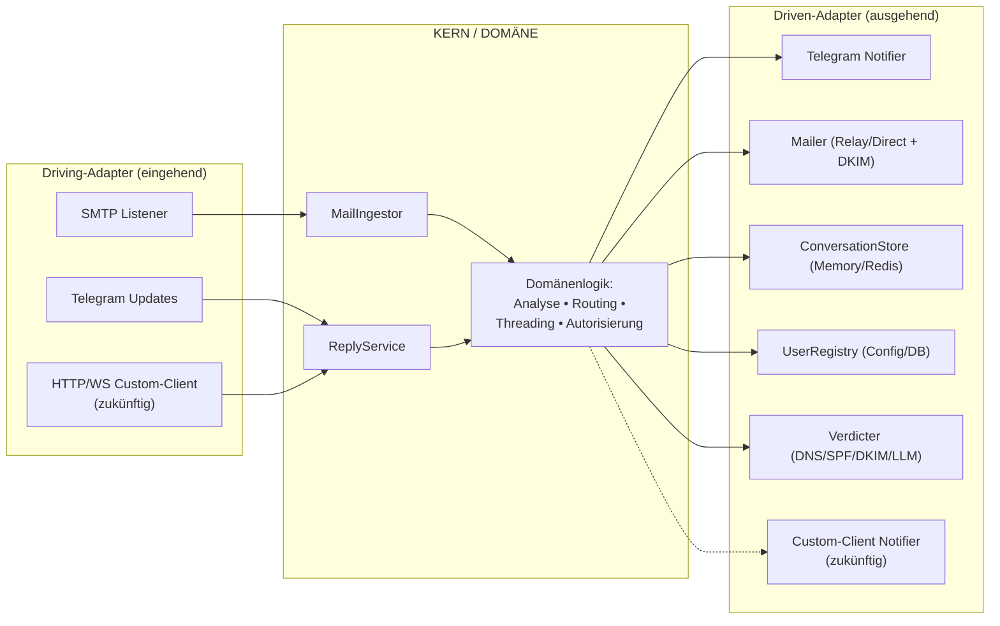
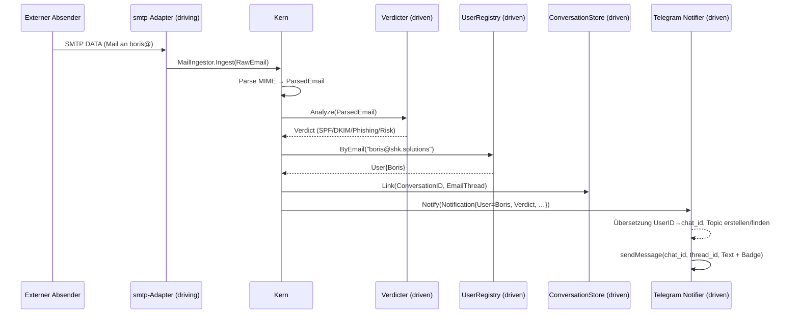
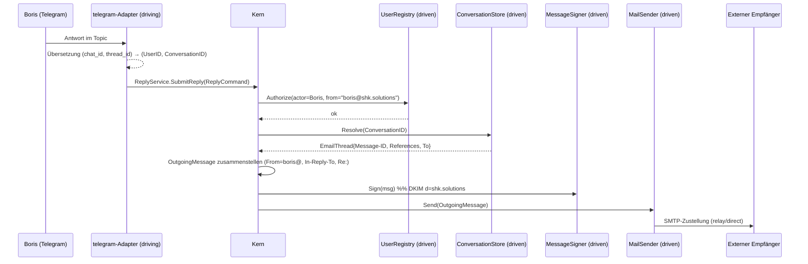

# 🏛️ Go-MailShield — Architekturdokument

> **Status:** Architekturentscheidung (Design Doc)
> **Datum:** 2026-07-24
> **Domain:** `shk.solutions` (Produktiv-VPS, DNS konfiguriert)
> **Bereich:** Architektur der Weiterentwicklung des Projekts von einem reinen
> Inbound-Mail-Analyzer zu einer **filternden Email ↔ Telegram-Brücke** für ein
> kleines Team, aufgebaut nach hexagonaler Architektur (Ports & Adapters) mit
> Blick auf die künftige Anbindung eines Custom-Clients.

---

## Inhaltsverzeichnis

1. [Produktkonzept](#1-produktkonzept)
2. [Ziele und Nicht-Ziele](#2-ziele-und-nicht-ziele)
3. [Gesamtarchitektur (Ports & Adapters)](#3-gesamtarchitektur-ports--adapters)
4. [Domänenmodell](#4-domänenmodell)
5. [Ports](#5-ports)
6. [Adapter](#6-adapter)
7. [Datenflüsse](#7-datenflüsse)
8. [Multi-User-Routing und Telegram-Topologie](#8-multi-user-routing-und-telegram-topologie)
9. [Zustand der Konversation (Threading)](#9-zustand-der-konversation-threading)
10. [Sicherheit und Zustellbarkeit](#10-sicherheit-und-zustellbarkeit)
11. [Paketstruktur](#11-paketstruktur)
12. [Erweiterungspunkte: Custom-Client](#12-erweiterungspunkte-custom-client)
13. [Evolution des Speichers](#13-evolution-des-speichers)
14. [Verbindung zur Roadmap](#14-verbindung-zur-roadmap)
15. [Protokoll der Kernentscheidungen (ADR-lite)](#15-protokoll-der-kernentscheidungen-adr-lite)
16. [Offene Fragen](#16-offene-fragen)

---

## 1. Produktkonzept

Go-MailShield hört auf, eine „Sackgasse" zu sein (Mail empfangen → ins Log
geschrieben) und wird zu einer **filternden Brücke zwischen Email und
Telegram**:

- Mails an Domain-Adressen (`fima@shk.solutions`, `boris@shk.solutions`, …)
  werden per SMTP angenommen, **durchlaufen eine Sicherheitsanalyse**
  (SPF/DKIM/DMARC, Phishing, Anhänge) und werden **dem Besitzer in Telegram**
  mit einem Verdict-Badge zugestellt.
- Die Antwort des Mitarbeiters **direkt in Telegram** wird zu einer
  ausgehenden Mail **von seiner Adresse**, landet im selben Email-Thread und
  geht an den Absender zurück.

Wesentliche Konsequenzen des Konzepts:

- **Telegram = Mail-Client und UI.** Kein IMAP, kein Webmail, keine
  Mailbox-Speicherung, kein Dovecot/Roundcube nötig — das nimmt die schwere
  Ops-Last „Mail wie bei den Großen" weg.
- **Das Unterscheidungsmerkmal ist keine dumme Brücke, sondern eine
  filternde.** Spam/Phishing wird vorab aussortiert und markiert; Anhänge
  werden **vor** der Weiterleitung geprüft (scan-before-forward — gleichzeitig
  Feature und Schutz des Empfängers selbst).
- **Der Go-Kern bleibt der eigentliche Wert** (Custom-Logik des Gateways),
  nicht „ich habe einen fertigen Mail-Stack installiert".

---

## 2. Ziele und Nicht-Ziele

### Ziele

- Empfang eingehender Mail per SMTP und Sicherheitsanalyse (bestehender Kern).
- Routing der Mail → an den richtigen Mitarbeiter in Telegram.
- Versand der Antwort aus Telegram → korrekte ausgehende Mail (Threading + DKIM).
- Unterstützung **mehrerer Mailboxen/Mitarbeiter** (Multi-User) auf einem Bot.
- **Isolation der Korrespondenz** zwischen Mitarbeitern und zwischen Threads.
- **Austauschbarkeit des Transports**: heute Telegram, morgen — ein
  Custom-Client, ohne den Kern umzuschreiben.

### Nicht-Ziele (bewusst außerhalb des Scopes)

- ❌ Reimplementierung von IMAP/POP3, Webmail, Mailbox-Speicherung, eines
  Antispam-Engines von Grund auf — das sind Jahre an Arbeit und die
  Neuerfindung sicherheitskritischer Software.
- ❌ Massenversand (Bulk-/Marketing-Mail).
- ❌ Offenes Relay (Open Relay) — der Versand ist strikt autorisiert.
- ❌ Ersatz eines professionellen Mail-Providers für kritische Korrespondenz.

---

## 3. Gesamtarchitektur (Ports & Adapters)

Prinzip: **der Kern (Domäne) deklariert Schnittstellen-Ports; Adapter
implementieren sie; alle Abhängigkeiten zeigen nach innen.** Der Kern
importiert niemals `tgbotapi`, `smtpd`, `redis`, `net.Addr` — Transport und
Infrastruktur werden ausgetauscht, ohne die Domäne zu ändern.

Ports werden in zwei Klassen unterteilt:

- **Driving (eingehend / primary)** — wie die Außenwelt die Anwendung
  *anstößt* (Use-Cases, die der Kern nach außen anbietet).
- **Driven (ausgehend / secondary)** — was die Anwendung *von außen braucht*
  (der Kern deklariert die Schnittstelle, die Infrastruktur implementiert sie).



> **Wichtig:** Telegram ist **auf beiden Seiten** des Hexagons präsent — als
> Driving-Adapter (eingehende Antwort stößt `ReplyService` an) und als
> Driven-Adapter (`Notifier`, der Kern pusht die Benachrichtigung). Ein
> künftiger Custom-Client wird **genau so angebunden — als Paar von
> Adaptern** an die bereits bestehenden Ports.

### Grenzdisziplin (wo solche Projekte üblicherweise „lecken")

Transportbegriffe **sickern nicht in den Kern**. `chat_id`,
`message_thread_id` sind Telegram-Sprache. Der Kern arbeitet nur mit
Domänen-Identifikatoren: `UserID`, `ConversationID`. Die Übersetzung
`(chat_id, thread_id) ↔ (UserID, ConversationID)` übernimmt der
**Telegram-Adapter an seiner eigenen Grenze**. Ein Custom-Client übersetzt
seine Identifikatoren in dieselben Domänen-IDs — und darum ist jeder Client
austauschbar.

---

## 4. Domänenmodell

Reine Typen ohne Infrastruktur-Abhängigkeiten.

| Typ | Zweck |
| :--- | :--- |
| `RawEmail` | Rohe Mail-Bytes + Umschlag (Absender-IP, `MAIL FROM`, `RCPT TO[]`). |
| `ParsedEmail` | Ergebnis des MIME-Parsings: Header, `Subject`, Text/HTML, Anhänge, `Message-ID`. |
| `Verdict` | Ergebnis der Analyse: SPF/DKIM/DMARC, Phishing-Heuristiken, Funde in Anhängen, integrierter Risk Score (1–10), Label `clean`/`suspicious`/`malicious`. |
| `User` / `Mailbox` | Adresse, Anzeigename, Client-Bindungen, Rechte. |
| `ConversationID` | Domänen-ID der Korrespondenz (nicht `chat_id`, nicht `thread_id`). |
| `EmailThread` | `Message-ID`, `References`, `Subject`, externer Teilnehmer, Besitzer (`User`). |
| `Notification` | Das, was an den Client gepusht wird (from/subject/body/verdict/attachments). |
| `ReplyCommand` | Transportneutraler Antwort-Befehl (Actor, Conversation, Body, Attachments). |
| `OutgoingMessage` | Signier- und versandfertige Mail (From, To, Subject, In-Reply-To, References, Body, Anhänge). |

---

## 5. Ports

Ports halten wir **grob, auf Use-Case-Ebene** (nicht „eine Schnittstelle pro
DB-Aufruf").

```go
package core

import "context"

// ---- DRIVING (eingehende) Ports: Use-Cases, die der Kern anbietet ----

// Wird vom SMTP-Adapter für jede empfangene Mail aufgerufen.
type MailIngestor interface {
    Ingest(ctx context.Context, raw RawEmail) error
}

// Wird vom Telegram-Adapter (und einem künftigen Custom-Client) bei einer Antwort aufgerufen.
type ReplyService interface {
    SubmitReply(ctx context.Context, cmd ReplyCommand) error
}

// ReplyCommand ist transportneutral: der Adapter hat seine IDs bereits in
// Domänen-IDs übersetzt und den Actor authentifiziert.
type ReplyCommand struct {
    Actor        UserID         // wer antwortet (vom Adapter authentifiziert)
    Conversation ConversationID // Domänen-ID, NICHT chat_id/thread_id
    Body         string
    Attachments  []Attachment
}

// ---- DRIVEN (ausgehende) Ports: was der Kern von außen braucht ----

// Notifier — hier bindet sich JEDER Client an (Telegram, Custom, …).
type Notifier interface {
    Notify(ctx context.Context, n Notification) error
}

// MailSender — Zustellung der ausgehenden Mail (Relay/Direct MTA).
type MailSender interface {
    Send(ctx context.Context, msg OutgoingMessage) error
}

// MessageSigner — DKIM-Signatur der ausgehenden Mail (d=shk.solutions).
type MessageSigner interface {
    Sign(msg *OutgoingMessage) error
}

// ConversationStore — Mapping Konversation ↔ Email-Thread.
type ConversationStore interface {
    Link(id ConversationID, thread EmailThread) error
    Resolve(id ConversationID) (EmailThread, bool)
}

// UserRegistry — Verzeichnis der Mitarbeiter und Autorisierung.
type UserRegistry interface {
    ByEmail(addr string) (User, bool)
    Authorize(actor UserID, fromAddr string) bool
}

// Verdicter — Sicherheitsanalyse; ruft intern selbst die Driven-Ports DNS/LLM auf.
type Verdicter interface {
    Analyze(ctx context.Context, e ParsedEmail) Verdict
}
```

Untergeordnete Driven-Ports von `Verdicter` (implementiert von
Infrastruktur-Adaptern): `DNSResolver`, `SPFChecker`, `DKIMVerifier`,
`DMARCEvaluator`, `LLMRiskScorer`.

---

## 6. Adapter

| Klasse | Adapter | Implementiert / ruft auf | Technologie |
| :--- | :--- | :--- | :--- |
| Driving | `smtp` | ruft `MailIngestor` auf | `mhale/smtpd` oder `emersion/go-smtp` |
| Driving | `telegram` (updates) | ruft `ReplyService` auf | Long-Polling `getUpdates` |
| Driving | `httpapi` *(zukünftig)* | ruft `ReplyService` auf | REST/WS/gRPC |
| Driven | `telegram` (notifier) | `Notifier` | Bot API `sendMessage`/`sendDocument` |
| Driven | `mailer` | `MailSender` + `MessageSigner` | Relay (Smart Host) / Direct MTA, DKIM |
| Driven | `store` | `ConversationStore`, `UserRegistry` | In-Memory → **SQLite** (`modernc.org/sqlite`, ohne cgo); Postgres/Redis — Wachstumspfade |
| Driven | `dns` | `DNSResolver`/`SPFChecker`/… | `net.LookupTXT/MX`, `context`-Timeouts |
| Driven | `llm` *(zukünftig)* | `LLMRiskScorer` | Claude/OpenAI API |
| Driven | `customclient` *(zukünftig)* | `Notifier` | Push/WS |

> Telegram ist **zwei Adapter**, die sich einen Bot-Client teilen: Driving
> (hört auf Updates, initiiert Reply) und Driven (pusht Benachrichtigungen).
> Das ist normal.

---

## 7. Datenflüsse

### 7.1. Eingehend: Email → Telegram



### 7.2. Ausgehend: Telegram → Email



---

## 8. Multi-User-Routing und Telegram-Topologie

Der Übergang von einem einzigen `support@` zu mehreren Mailboxen ist eine
**Verallgemeinerung**, keine Neukonstruktion. Es kommt eine Schicht **Routing
nach Empfänger** hinzu.

- **Eingehend:** `RCPT TO` → `UserRegistry.ByEmail` → Chat des zuständigen Mitarbeiters.
- **Ausgehend:** Update aus Boris' Chat → `From: boris@shk.solutions`.
- **Autorisierung pro User:** Boris' `chat_id` darf **nur** von `boris@` senden.
- **DKIM:** Signatur auf Domain-Ebene (`d=shk.solutions`) → **ein Schlüssel für alle Adressen**.
- **Unbekannter Empfänger:** `550 unknown user` (sauberer als Catch-all, ohne Backscatter).
- **Aliase/Verteiler:** `team@` → Fan-out in die Chats mehrerer Mitarbeiter
  (ergibt sich aus demselben Routing-Modell).

### Gewählte Topologie — „Variante 2": persönliche Gruppe + Topics für jeden

**Ein Bot** ist Mitglied mehrerer privater Supergroups (Forum-Modus):

```
                 ┌─────────────┐
                 │  EIN Bot    │  (ein Token)
                 └──────┬──────┘
          ┌────────────┴────────────┐
   [Boris Mail] (Forum)       [Fima Mail] (Forum)
    ├─ 🧵 client@acme — Bestellung Nr. 42     ├─ 🧵 partner@x — Vertrag
    └─ 🧵 vendor@corp — Rechnung ⚠️           └─ 🧵 hr@job — Stellenangebot
   (Boris + Bot)                     (Fima + Bot)
```

**Wie das auf einem einzigen Bot isoliert:**

1. **Zwischen Personen — `chat_id`.** Unterschiedliche Gruppen; Fima ist
   nicht Mitglied in Boris' Gruppe → sieht dessen Mail physisch nicht. Die
   Isolation garantiert Telegram (Membership), nicht unser Code.
2. **Zwischen Korrespondenzen — `message_thread_id`.** Forum-Topics innerhalb
   der Gruppe; jede Korrespondenz = ein eigenes Topic.

Jedes eingehende `Update` enthält `chat.id` **und** `message_thread_id` — das
ist bereits die vollständige „Adresse" der Antwort: Ersteres wählt die
Person, Letzteres den Thread.

**Anforderungen an die Konfiguration:**

- Ein Bot bei `@BotFather` (ein Token für alles).
- Eine Supergroup pro Person, **Topics** aktiviert.
- Der Bot — **Admin mit dem Recht „Manage Topics"** (`can_manage_topics`),
  sonst kann er über die API keine Topics erstellen.
- Die `chat_id` jeder Gruppe (große negative Zahl `-100…`) ist im Registry
  hinterlegt.

**Vorbehalte:**

- Die Korrektheit des Routings liegt **bei unserem Code**; ein Bug im
  `registry` kann Boris' Mail in Fimas Chat leiten. Telegram sichert nur die
  Unsichtbarkeit für Fremde ab.
- Ein Bot = **ein Vertrauenspunkt**: der Token-Besitzer sieht technisch alle
  Gruppen (der Bot ist die Brücke). Für eine kleine Firma — akzeptabel.

> Für später: **Variante 3** — eine gemeinsame Inbox-Gruppe mit Topics — für
> Team-Postfächer (`support@`, `sales@`), bei denen sich jeder freie
> Mitarbeiter der Anfrage annimmt. Der Unterschied: **gemeinsame
> Sichtbarkeit** statt persönlicher Mail.

---

## 9. Zustand der Konversation (Threading)

Das Herzstück des Systems ist ein bidirektionales Mapping:

```
ConversationID  ↔  EmailThread{ external_sender, Subject, Message-ID, References }
             und  ↔  Bindung an den Client-Transport (im Adapter: chat_id + thread_id)
```

- Beim Eingang wird eine `ConversationID` erzeugt, `ConversationStore.Link(...)`
  speichert den Email-Thread; der Telegram-Adapter legt ein Topic an und hält
  seine eigene Zuordnung `ConversationID ↔ (chat_id, thread_id)`.
- Bei einer Antwort liefert `ConversationStore.Resolve(...)` `Message-ID`/`References`,
  um `In-Reply-To`/`References` und `Re: Subject` zu setzen — so landet die
  Antwort **im selben Thread** in der Mailbox des Absenders.
- Aktuell — In-Memory; als Nächstes — Redis/DB mit TTL (siehe §13).

---

## 10. Sicherheit und Zustellbarkeit

### Autorisierung (kritisch)

- Über den Bot antworten kann **nur** eine verknüpfte `chat_id`, und **nur**
  von der eigenen Adresse (`UserRegistry.Authorize`). Sonst — Open Relay über
  Telegram.
- Anhänge und Links werden **vor** der Weiterleitung an Telegram geprüft
  (keine Malware an sich selbst weiterschleppen).

### Zustellbarkeit ausgehender Mail (Code — 10 %, Deliverability — 90 %)

Einen SMTP-Client zu schreiben ist einfach; dafür zu sorgen, dass die Mail im
Posteingang ankommt — nicht. Checkliste für `shk.solutions`:

| Anforderung | Wofür | Maßnahme |
| :--- | :--- | :--- |
| Ausgehender Port 25 | Viele VPS (IONOS) blockieren ihn standardmäßig | `telnet gmail-smtp-in.l.google.com 25` prüfen; Freischaltung beantragen **oder** über ein Relay gehen |
| PTR / rDNS | Ohne gültigen PTR schneiden Gmail/Outlook ab | `mail.shk.solutions` im Panel setzen, muss mit HELO und A-Record übereinstimmen |
| DKIM-Signatur + DNS | Authentifizierung des Ausgangs | Signieren (`d=shk.solutions`), `selector._domainkey` veröffentlichen |
| SPF | IP zum Versenden autorisieren | `ip4:<IP>` im TXT (nicht nur `-all`) |
| DMARC | Alignment-Policy | Mit `p=none` beginnen (Monitoring) |
| IP-Reputation | VPS-Bereiche stehen oft auf Blocklisten | Bei Spamhaus/mxtoolbox prüfen |

**Pragmatik:** Für zuverlässige Zustellung — `RelaySender` über einen
reputablen Smart Host (SES/Mailgun/Postmark). `DirectMTASender` (eigenes
MX-Resolving + STARTTLS + DSN) behalten wir als alternative Implementierung
von `MailSender` zu Lernzwecken. Zusatz: Antworten an Leute, die **uns
zuerst geschrieben haben**, kommen deutlich zuverlässiger an.

---

## 11. Paketstruktur

```
/internal
  /core
     model.go            # Email, Verdict, Conversation, User, Reply — reine Domäne
     ports.go            # Port-Schnittstellen (oder Split: inbound.go / outbound.go)
     /app                # Implementierung der Use-Cases
        ingest.go        # MailIngestor
        reply.go         # ReplyService
        analyze.go       # Orchestrierung der Analyse
  /adapters
     /inbound  (driving)
        /smtp            # → MailIngestor
        /telegram        # Updates → ReplyService
        /httpapi         # ZUKÜNFTIGER Custom-Client → ReplyService
     /outbound (driven)
        /telegram        # Notifier (Push nach TG)
        /mailer          # MailSender + MessageSigner (relay/direct + DKIM)
        /store           # ConversationStore, UserRegistry (memory/redis)
        /dns   /llm      # Abhängigkeiten von Verdicter
main.go                  # Composition Root: einzige Stelle, die konkrete Typen kennt
```

**Abhängigkeitsregel:** `core` importiert nichts aus `adapters`.
`adapters` importieren `core` (implementieren/rufen Ports auf). `main.go`
kennt alle und verdrahtet sie (Dependency Injection).

---

## 12. Erweiterungspunkte: Custom-Client

Genau dafür wurde die hexagonale Architektur gewählt. Die Anbindung eines
neuen Clients (Web/Mobile/Desktop) — **drei Schritte, Kern und bestehende
Adapter werden nicht verändert**:

1. **Driving-Adapter** `/adapters/inbound/httpapi` (REST/WS/gRPC):
   authentifiziert seinen eigenen User, übersetzt seine IDs in Domänen-IDs
   (`UserID`/`ConversationID`), ruft denselben `ReplyService.SubmitReply` auf.
2. **Driven-Adapter** `/adapters/outbound/customclient`, der `Notifier`
   implementiert: pusht Benachrichtigungen an diesen Client.
3. **Eine Zeile** Verdrahtung in `main.go`.

Soll die Benachrichtigung **sowohl** an Telegram **als auch** an den
Custom-Client gehen — verpacken wir beide `Notifier` in einen
**Composite-(Fan-out)-Notifier**. Ebenfalls ohne Änderungen am Kern.

```go
// Composite Notifier: verteilt an alle angebundenen Clients.
type FanOutNotifier struct{ targets []core.Notifier }

func (f FanOutNotifier) Notify(ctx context.Context, n core.Notification) error {
    for _, t := range f.targets {
        if err := t.Notify(ctx, n); err != nil {
            // loggen/sammeln; nicht die übrigen Kanäle mitreißen
        }
    }
    return nil
}
```

---

## 13. Evolution des Speichers

**Weg:** `InMemoryStore` → **SQLite (primary)** → *(bei Bedarf)* Postgres / Redis.

- **Aktuell (Bootstrap):** `InMemoryStore` (threadsicher, `sync.RWMutex`) —
  Implementierung der Ports `ConversationStore`/`UserRegistry`. Taugt nur für
  den ersten Durchlauf: **beim Neustart gehen die Thread-Mappings verloren**
  → eine eingehende Antwort aus Telegram hat nichts, woran sie andocken kann
  (`Message-ID`/`References` verloren).
- **Basis dieser Phase — `SQLiteStore`.** Für die aktuelle Aufgabe (mehrere
  Mailboxen, Mail-Aufkommen im menschlichen Tempo, ein VPS, eine Binary) ist
  SQLite kein „Notbehelf", sondern der richtige Standard:
  - **Durability = Korrektheit:** übersteht einen Neustart, Thread-Mappings
    gehen nicht verloren.
  - **Relationalität:** `users`/`conversations`/`messages`/`verdicts` mit
    Beziehungen und Abfragen (Historie, Audit, Suche) — dafür ist Redis
    (KV/Cache) unpraktisch.
  - **Null Ops:** eine Datei, kein separater Container/Daemon/Netzwerk —
    wichtig auf einem 1-GB-VPS.
  - **ACID:** atomare Verknüpfung „Korrespondenz + Thread + Topic" in einem
    Commit.
  - **Backup** — durch Kopieren der Datei.
  - **Treiber — `modernc.org/sqlite` (reines Go, ohne cgo)**, um den
    statischen Build `CGO_ENABLED=0` zu erhalten (`mattn/go-sqlite3`
    benötigt cgo und würde ihn brechen). Beim Öffnen:
    `PRAGMA journal_mode=WAL; PRAGMA busy_timeout=5000;`. Einziger
    Schreiber ist die Binary selbst, bei diesem Volumen gibt es keine
    Nebenläufigkeit.
- **Wachstumspfade (nicht jetzt):**
  - **Postgres** — falls horizontale Skalierung / mehrere
    Anwendungsinstanzen nötig werden (SQLite ist Single-Node).
  - **Redis** — nur als **Hot-Cache mit TTL** (z. B. Cache für
    DNS-/SPF-/DKIM-Antworten), nicht als Primärspeicher. Der ursprüngliche
    Plan aus dem TODO (`RedisStore` als Basis) wurde revidiert: diese Daten
    sind primär und relational, kein Cache.
- Da dies ein **Port** ist, ist jeder Austausch ein Adapter: Kern und Clients
  bleiben unangetastet.

---

## 14. Verbindung zur Roadmap

Diese Architektur **ordnet** das bestehende `SMPT_SELF_TODO.md` ein — jede
Phase bekommt ihren Platz:

| TODO-Phase | Wo es in der Architektur lebt |
| :--- | :--- |
| DKIM/DMARC (Phase 1) | `Verdicter` (eingehend) + `MessageSigner` (ausgehend) |
| Phishing/URL/Attachment (Phase 1) | `Verdicter`-Heuristiken → `Verdict.risk` |
| SQLite + `slog` + `context` (Phase 2) | `store`-Adapter (`modernc.org/sqlite`) + durchgängiger `ctx` in den Ports |
| REST API (Phase 3) | Driving-Adapter `httpapi` (zugleich Vorarbeit für Custom-Client) |
| AI/LLM Risk Score (Phase 4) | Driven-Port `LLMRiskScorer` → Adapter `llm` |
| Tests/Linting (Phase 5) | Kern wird mit Port-Mocks getestet (ohne Netzwerk) |

Zusätzlicher Gewinn: **der Kern wird mit Unit-Tests auf Basis von
Port-Doubles getestet** — ohne SMTP, ohne Telegram, ohne Netzwerk.

---

## 15. Protokoll der Kernentscheidungen (ADR-lite)

| # | Entscheidung | Begründung |
| :--- | :--- | :--- |
| 1 | Telegram als UI statt IMAP/Webmail | Nimmt die Ops-Last des Mail-Stacks; der Go-Kern bleibt der eigentliche Wert |
| 2 | Hexagonale Architektur | Explizites Ziel: Austauschbarkeit des Clients, ohne den Kern umzuschreiben |
| 3 | Die Brücke ist **filternd** (scan-before-forward) | Differenzierungsmerkmal + Schutz des Empfängers vor Malware |
| 4 | Ein Bot, Variante 2 (persönliche Gruppen + Topics) | Privatsphäre (chat_id) + Threads (thread_id) auf einem Token |
| 5 | Ausgehend vorzugsweise über Relay | Deliverability; `DirectMTA` — als Lernalternative |
| 6 | Ein DKIM-Schlüssel pro Domain | `d=shk.solutions` deckt alle Adressen ab; einfacher |
| 7 | Unbekannter Empfänger → `550` | Sauberer als Catch-all, ohne Backscatter |
| 8 | Transport-IDs dringen nicht in den Kern ein | Übersetzung an der Adapter-Grenze = Austauschbarkeit der Clients |
| 9 | **SQLite als Primärspeicher** (statt Redis aus dem TODO) | Die Daten sind primär, langlebig und relational, kein Cache; Durability wird gebraucht, um Thread-Mappings zu erhalten; null Ops auf einem 1-GB-VPS. Der Treiber `modernc.org/sqlite` (ohne cgo) erhält den statischen Build `CGO_ENABLED=0`. Redis nur als optionaler TTL-Cache, Postgres bei Multi-Node |

---

## 16. Offene Fragen

- **Onboarding der Bindung:** statische Konfiguration (`email ↔ chat_id`) für
  das MVP vs. Self-Service `/link <Adresse> <Code>` — wann umsteigen?
- **Port 25 bei IONOS:** ist der ausgehende Port offen? Falls nicht und keine
  Freischaltung erfolgt — verschiebt sich die Architektur zu **Relay-only**.
- **Persönliche vs. gemeinsame Mailboxen:** `fima@`/`boris@` — persönliche
  Mail (Variante 2) oder Teil einer gemeinsamen Inbox (Variante 3) für
  bestimmte Adressen?
- **Speicherung der Historie:** Telegram als einziges Archiv, oder die
  Korrespondenz zusätzlich in der DB für Suche/Audit spiegeln?
- **Webhook vs. Long-Polling:** für das MVP — Long-Polling; Umstieg auf
  Webhook bei Wachstum (benötigt einen öffentlichen HTTPS-Endpunkt, die
  Domain existiert bereits).

---

*Das Dokument beschreibt die Zielarchitektur und Entscheidungen Stand
2026-07-24. Im Zuge der Umsetzung aktualisieren Sie die Abschnitte §5–§7
(Port-Signaturen) und §15 (Entscheidungsprotokoll).*
