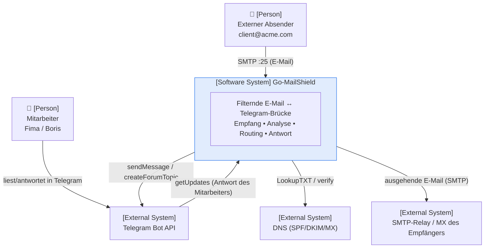
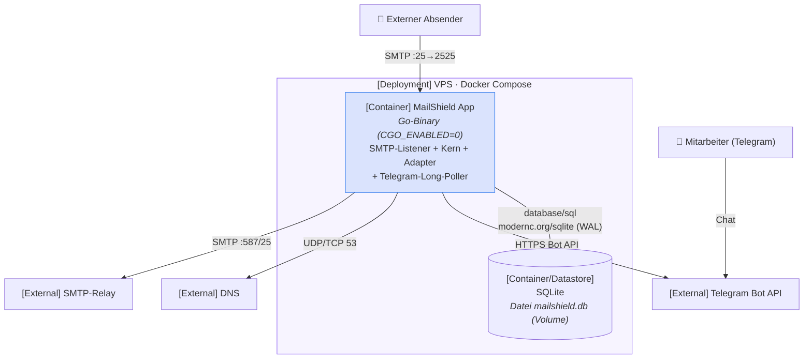
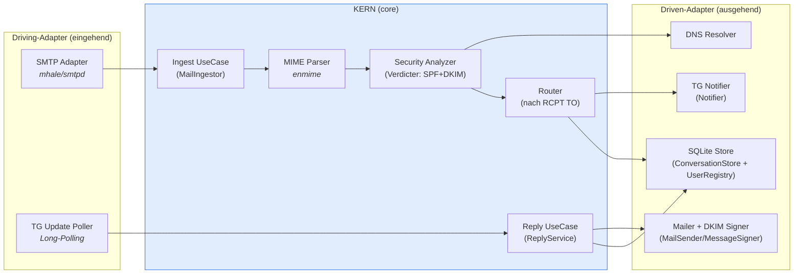
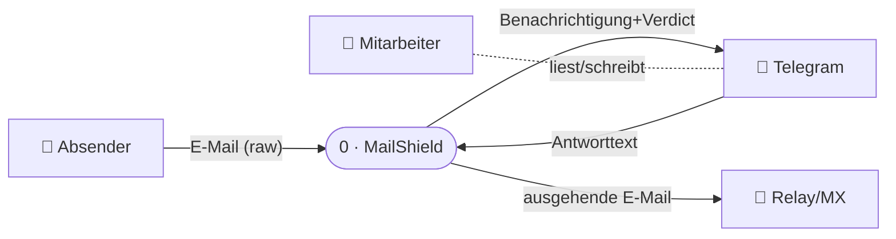
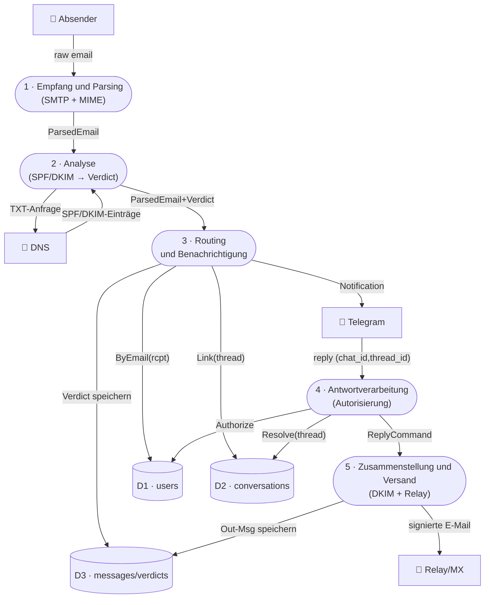
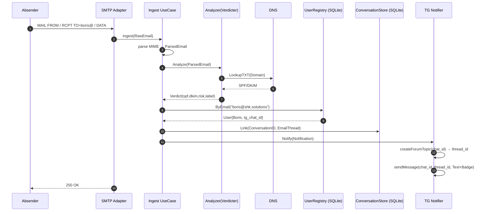
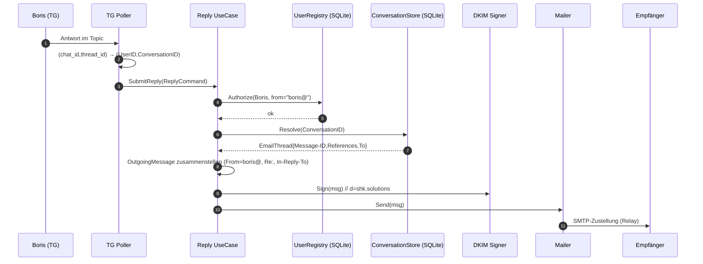
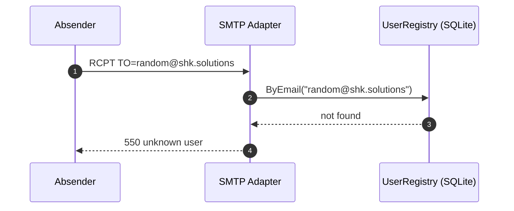

# 📐 Go-MailShield — MVP-Design (vor Beginn der Programmierung)

> **Ziel:** die Architekturentscheidung **vor dem Schreiben von Code** festhalten.
> **Methode:** das **C4**-Modell (Context → Containers → Components), Datenfluss-
> diagramme **(DFD)** und **Sequence**-Diagramme.
> **Status:** MVP-Design · **Datum:** 2026-07-24
> **Kontext:** Dieses Dokument ist ein MVP-Ausschnitt der Zielarchitektur aus
> [`ARCHITECTURE.md`](./ARCHITECTURE.md) (Ports & Adapters). Hier ist das
> **Minimum, das wir zuerst bauen**, beschrieben; das Gesamtbild und die Begründungen der Entscheidungen stehen dort.

---

## Inhaltsverzeichnis

1. [Was das MVP macht](#1-was-das-mvp-macht)
2. [Grenzen des MVP (Scope)](#2-grenzen-des-mvp-scope)
3. [C4 · Ebene 1 — System Context](#3-c4--ebene-1--system-context)
4. [C4 · Ebene 2 — Containers](#4-c4--ebene-2--containers)
5. [C4 · Ebene 3 — Components](#5-c4--ebene-3--components)
6. [DFD · Datenflussdiagramme](#6-dfd--datenflussdiagramme)
7. [Sequenzdiagramme](#7-sequenzdiagramme)
8. [Datenmodell (SQLite)](#8-datenmodell-sqlite)
9. [Externe Schnittstellen und Verträge](#9-externe-schnittstellen-und-verträge)
10. [Konfiguration](#10-konfiguration)
11. [Fertigstellungskriterien des MVP (Definition of Done)](#11-fertigstellungskriterien-des-mvp-definition-of-done)
12. [Annahmen und Risiken](#12-annahmen-und-risiken)

---

## 1. Was das MVP macht

In einem Satz: **Eine E-Mail an die Adresse eines Mitarbeiters landet für ihn in
Telegram mit einem Sicherheits-Badge; die Antwort aus Telegram wird als E-Mail
von seiner Adresse im selben Thread verschickt.**

End-to-End-Szenario des MVP:

1. Ein externer Absender schickt eine E-Mail an `boris@shk.solutions`.
2. MailShield nimmt sie per SMTP an, parst MIME, prüft **SPF + DKIM**.
3. Routet nach `RCPT TO` → findet den Mitarbeiter → erstellt ein **Topic** in
   seiner persönlichen Telegram-Gruppe und postet die E-Mail + das Verdict.
4. Boris antwortet **direkt im Topic**.
5. MailShield stellt die ausgehende E-Mail zusammen (`From: boris@`,
   Threading-Header), **signiert sie mit DKIM** und sendet sie über den Relay.
6. Der gesamte Zustand (Benutzer, Konversationen, Threads) liegt in **SQLite**.

---

## 2. Grenzen des MVP (Scope)

| Im MVP enthalten ✅ | NICHT im MVP enthalten ❌ (verschoben in [`ARCHITECTURE.md`](./ARCHITECTURE.md)) |
| :--- | :--- |
| SMTP-Empfang + MIME-Parsing | Phishing-/URL-Heuristiken |
| Analyse **SPF + DKIM** (verify) | Anhangs-Scanner (SHA-256, doppelte Dateiendungen) |
| Routing nach Empfänger (Multi-User) | AI/LLM-Risk-Score |
| Telegram: persönliche Gruppen + Topics (**Variante 2**) | DMARC-Enforcement (nur Ergebnis wird festgehalten) |
| Antwort aus Telegram → ausgehende E-Mail | Direct-MTA-Zustellung (im MVP nur Relay) |
| DKIM-Signatur für Ausgehendes | HTTP-API / Custom-Client |
| Threading (`In-Reply-To`/`References`) | Self-Service-Onboarding (`/link`) |
| Speicher **SQLite** | Webhook (im MVP: Long-Polling) |
| Benutzerregister aus Konfig/DB | Catch-all (unbekannte Adresse → `550`) |
| Autorisierung pro Benutzer bei Antworten | Anhänge aus der E-Mail → nach Telegram (im MVP nur Text) |

**Das zentrale Ziel des MVP** ist es, den End-to-End-Zyklus E-Mail ↔ Telegram
mit korrektem Threading und persistentem Zustand über Neustarts hinweg
nachzuweisen. Alles Weitere sind Features obendrauf.

---

## 3. C4 · Ebene 1 — System Context

Wer nutzt das System und womit kommuniziert es nach außen.



**Akteure und externe Systeme:**

| Element | Rolle |
| :--- | :--- |
| Externer Absender | Schickt eine E-Mail an eine Domain-Adresse; erhält eine Antwort. |
| Mitarbeiter (Fima/Boris) | Liest Eingehendes und antwortet **innerhalb von Telegram**. |
| Telegram Bot API | UI-Transport: Zustellung von Eingehendem, Empfang von Antworten. |
| DNS | Quelle für SPF/DKIM-Einträge (verify) und MX (bei Direct-Zustellung, außerhalb des MVP). |
| SMTP-Relay / MX | Letzte Meile der Zustellung von Ausgehendem. |

---

## 4. C4 · Ebene 2 — Containers

Deploybare Einheiten. Das MVP ist bewusst kompakt gehalten: **ein Go-Prozess +
eine DB-Datei**.



**Container:**

| Container | Technologie | Zweck |
| :--- | :--- | :--- |
| **MailShield App** | Go (eine statische Binary) | Die gesamte Domäne + Adapter in einem Prozess; Concurrency über Goroutinen/Channels. |
| **SQLite** | `modernc.org/sqlite`, WAL | Dauerhafter relationaler Speicher (users/conversations/messages/verdicts). |
| Telegram Bot API | extern | UI-Transport. |
| DNS | extern | SPF/DKIM-Verify. |
| SMTP-Relay | extern | Zustellung von Ausgehendem (Deliverability). |

> Im MVP gibt es **kein** Redis — der Zustand ist primär relational und liegt
> in SQLite (siehe §13 `ARCHITECTURE.md`).

---

## 5. C4 · Ebene 3 — Components

Das Innere des Containers **MailShield App** = das Hexagon. Abhängigkeiten
zeigen nach innen.



**Komponenten und ihre Ports:**

| Komponente | Klasse | Port (Interface) |
| :--- | :--- | :--- |
| SMTP Adapter | driving | ruft `MailIngestor` auf |
| TG Update Poller | driving | ruft `ReplyService` auf |
| Ingest / Reply UseCase | Kern | implementieren Driving-Ports, orchestrieren die Domäne |
| Security Analyzer | Kern | `Verdicter` (ruft `DNSResolver` auf) |
| Router | Kern | nutzt `UserRegistry` + `ConversationStore` |
| TG Notifier | driven | `Notifier` |
| Mailer + Signer | driven | `MailSender` + `MessageSigner` |
| SQLite Store | driven | `ConversationStore` + `UserRegistry` |
| DNS Resolver | driven | `DNSResolver` |

> **Ebene 4 (Code)** wird nicht als eigenes Diagramm gezeichnet — die
> Port-Signaturen sind in §5 `ARCHITECTURE.md` (`ports.go`) festgehalten.

---

## 6. DFD · Datenflussdiagramme

**Legende:** `👤 externe Entität` · `([Prozess])` · `[(Datenspeicher)]`.

### 6.1. DFD Level 0 (Kontext)



### 6.2. DFD Level 1 (Prozesszerlegung)



---

## 7. Sequenzdiagramme

### 7.1. Eingehend: E-Mail → Telegram



### 7.2. Ausgehend: Telegram → E-Mail



### 7.3. Ablehnung einer unbekannten Adresse



---

## 8. Datenmodell (SQLite)

```sql
-- Mitarbeiter / Postfächer (Routing-Register + Autorisierung)
CREATE TABLE users (
    id           INTEGER PRIMARY KEY,
    email        TEXT    NOT NULL UNIQUE,        -- boris@shk.solutions
    display_name TEXT,
    tg_chat_id   INTEGER NOT NULL,               -- persönliche Gruppe (-100...)
    active       INTEGER NOT NULL DEFAULT 1
);

-- Konversationen (Thread = externer Kontakt + Owner + Topic)
CREATE TABLE conversations (
    id              TEXT    PRIMARY KEY,          -- ConversationID (uuid)
    owner_user_id   INTEGER NOT NULL REFERENCES users(id),
    external_addr   TEXT    NOT NULL,             -- client@acme.com
    subject         TEXT,
    root_message_id TEXT,                         -- Message-ID der ersten E-Mail
    tg_thread_id    INTEGER,                      -- message_thread_id des Topics
    created_at      TEXT    NOT NULL,
    updated_at      TEXT    NOT NULL,
    UNIQUE(owner_user_id, external_addr)          -- ein Thread pro Kontakt und Mitarbeiter
);

-- Nachrichten (Threading + Verlauf)
CREATE TABLE messages (
    id              INTEGER PRIMARY KEY,
    conversation_id TEXT    NOT NULL REFERENCES conversations(id),
    direction       TEXT    NOT NULL,             -- 'in' | 'out'
    message_id      TEXT,                         -- Message-ID
    in_reply_to     TEXT,
    refs            TEXT,                         -- References
    from_addr       TEXT,
    to_addr         TEXT,
    subject         TEXT,
    body_preview    TEXT,
    created_at      TEXT    NOT NULL
);

-- Analyse-Verdicts
CREATE TABLE verdicts (
    message_pk INTEGER PRIMARY KEY REFERENCES messages(id),
    spf        TEXT,        -- pass/fail/softfail/none
    dkim       TEXT,        -- pass/fail/none
    risk       INTEGER,     -- 1..10
    label      TEXT,        -- clean/suspicious/malicious
    details    TEXT         -- JSON (rohe Details)
);

-- Öffnen der DB: PRAGMA journal_mode=WAL; PRAGMA busy_timeout=5000;
```

**Zuordnung zu Ports:** `users` → `UserRegistry`;
`conversations` + `messages` → `ConversationStore`; `verdicts` → Analyse-Verlauf.

---

## 9. Externe Schnittstellen und Verträge

| Interface | Richtung | Vertrag (MVP) |
| :--- | :--- | :--- |
| **SMTP-Empfang** | eingehend | `MAIL FROM`, `RCPT TO`, `DATA`; `250` bei Annahme, `550` für unbekannte Adresse, `4xx` bei Warteschlangen-Überlauf |
| **Telegram Bot API** | ein-/ausgehend | `getUpdates` (Long-Poll); `createForumTopic`, `sendMessage` (parse_mode, `message_thread_id`) |
| **DNS** | ausgehend | `LookupTXT` für SPF; öffentlicher DKIM-Schlüssel `selector._domainkey.<domain>` |
| **SMTP-Relay** | ausgehend | AUTH + STARTTLS zum Smart Host; E-Mail mit `DKIM-Signature`, `In-Reply-To`, `References` |

**Anforderungen an die Telegram-Einrichtung (MVP):** ein Bot bei `@BotFather`;
eine Supergroup pro Mitarbeiter mit aktivierten Topics; der Bot ist Admin mit
dem Recht `can_manage_topics`.

---

## 10. Konfiguration

Über Umgebungsvariablen (12-Factor); Secrets nicht im Image.

```
BIND_ADDR=0.0.0.0:2525          # SMTP-Listener
DB_PATH=/data/mailshield.db     # SQLite (Docker-Volume)
TELEGRAM_BOT_TOKEN=...          # ein Token für alles
DOMAIN=shk.solutions
DKIM_SELECTOR=mail
DKIM_KEY_PATH=/keys/dkim_private.pem
RELAY_ADDR=smtp.relay.example:587
RELAY_USER=...
RELAY_PASS=...
```

Das Benutzerregister liegt in der Tabelle `users` (Seeding aus der
Konfiguration beim Start):

```yaml
users:
  - email: fima@shk.solutions
    tg_chat_id: -1001111111111
  - email: boris@shk.solutions
    tg_chat_id: -1002222222222
```

---

## 11. Fertigstellungskriterien des MVP (Definition of Done)

- [ ] Eine E-Mail an `boris@shk.solutions` erscheint als **neues Topic** in
      Boris' Gruppe mit dem Badge `SPF/DKIM`.
- [ ] Die Antwort im Topic wird als E-Mail **`From: boris@`** zugestellt,
      korrekt **threaded** (`In-Reply-To`/`References`) und **DKIM-signiert**.
- [ ] Eine E-Mail an zwei Adressen (`fima@`, `boris@`) geht an **beide** in
      ihre jeweiligen Gruppen (Fan-out-Routing).
- [ ] Eine E-Mail an eine unbekannte Adresse → **`550`**.
- [ ] Von einer fremden Adresse aus einem „nicht eigenen" Chat zu antworten
      ist **nicht möglich** (Autorisierung).
- [ ] Ein **Container-Neustart** erhält das Mapping von Konversationen und
      Threads (SQLite).
- [ ] Der Kern ist mit Unit-Tests **auf Basis von Port-Mocks** abgedeckt (ohne
      Netzwerk/SMTP/Telegram).

---

## 12. Annahmen und Risiken

| # | Annahme / Risiko | Auswirkung auf das Design |
| :--- | :--- | :--- |
| A1 | **Ausgehender Port 25/587** ist offen (oder ein Relay ist erreichbar) | `telnet ... 25` prüfen. Wenn geschlossen und kein Relay erreichbar ist — der ausgehende Zyklus des MVP schlägt fehl; Blocker |
| A2 | **Deliverability**: PTR, SPF, DKIM, DMARC sind konfiguriert | Sonst landen Antworten im Spam; für das MVP nutzen wir **Relay über Smart Host** |
| A3 | Der Bot ist **Admin mit `can_manage_topics`** | Ohne dieses Recht kann kein Topic erstellt werden → Variante 2 funktioniert nicht |
| A4 | **Menschliches Tempo** beim E-Mail-Aufkommen | Rechtfertigt SQLite + einen Prozess; Skalierung wird nicht ausgelegt |
| A5 | Telegram-Nachrichtenlimit (4096) | Bei langen E-Mails wird die Vorschau gekürzt (vollständiger Body/Anhänge — außerhalb des MVP) |
| A6 | HTML-E-Mails | Im MVP wird `text` verwendet, bei Fehlen davon ein gekürztes `html` als Text |

---

*MVP-Design-Dokument vom 2026-07-24. Die vollständige Zielarchitektur, Ports
und das Entscheidungsprotokoll stehen in [`ARCHITECTURE.md`](./ARCHITECTURE.md).
Im Verlauf der Umsetzung aktualisieren Sie §8 (Schema), §11 (DoD) und §12
(Risiken).*
